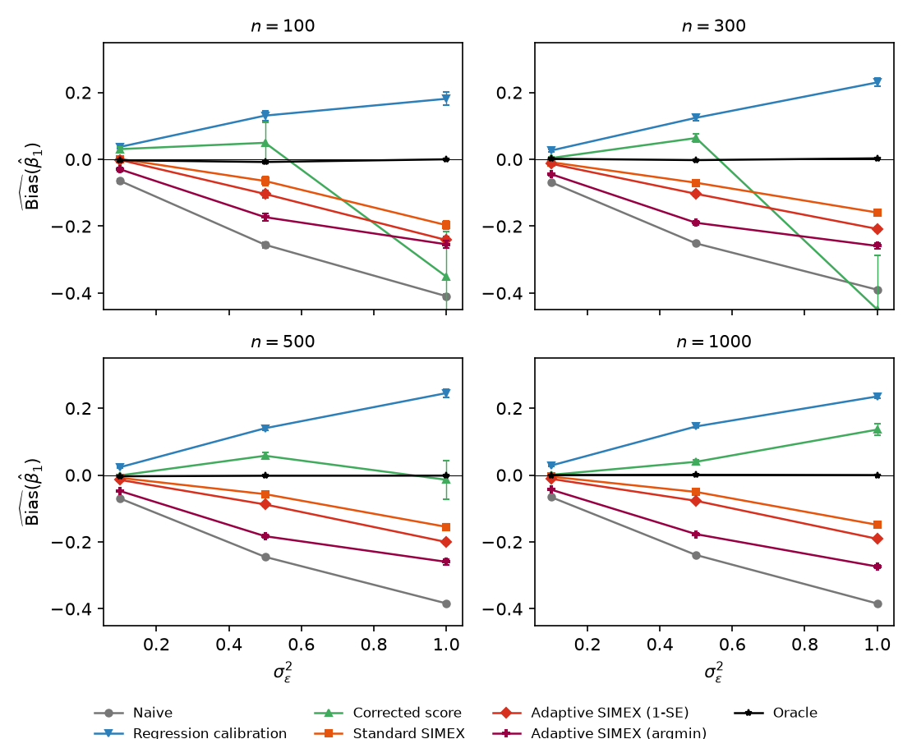
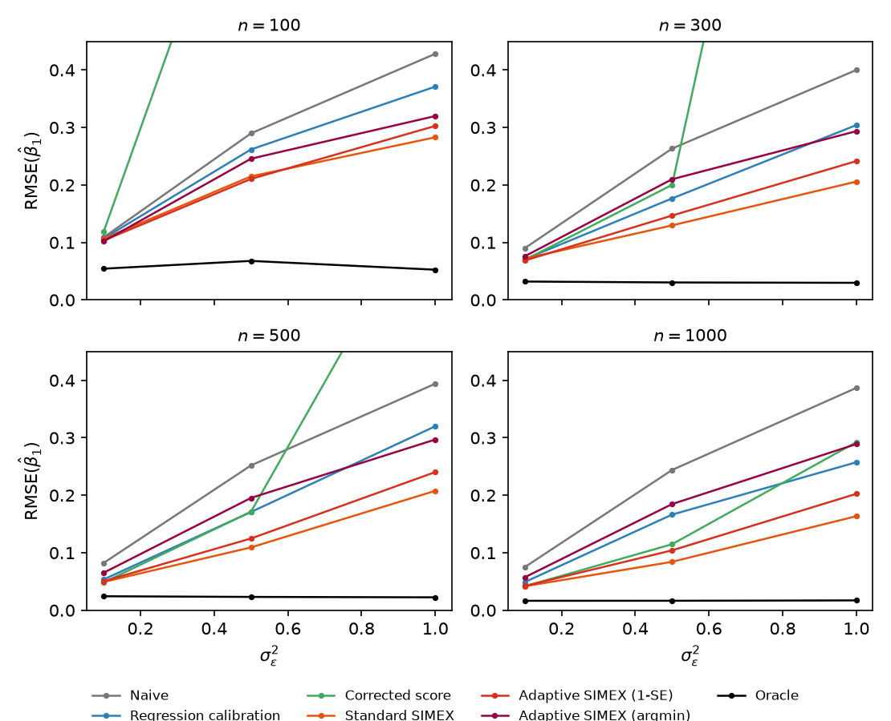
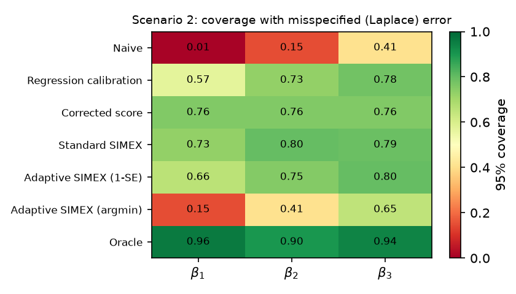
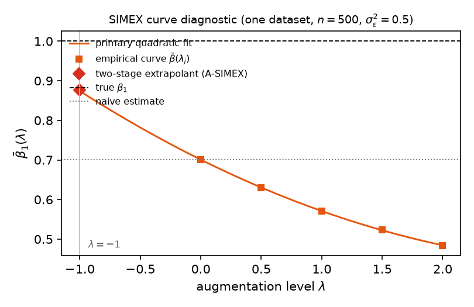
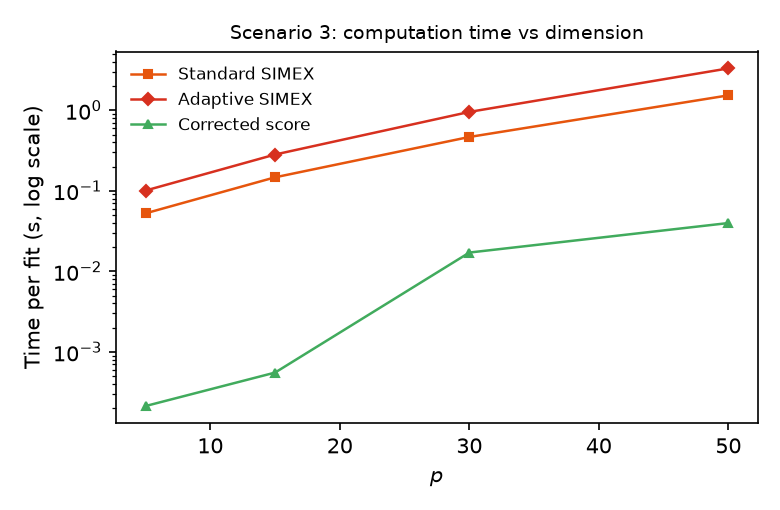
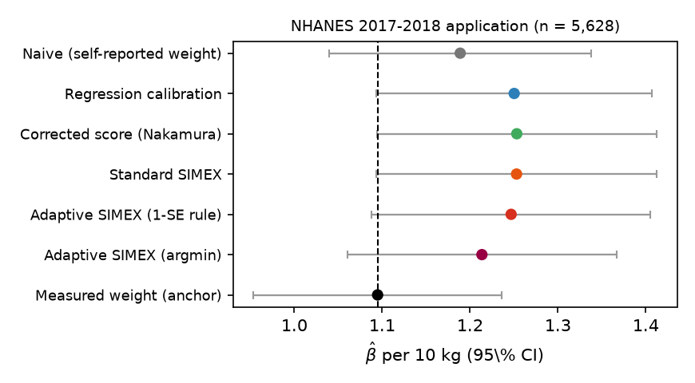
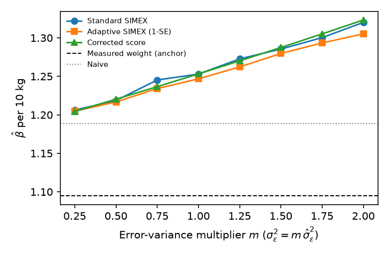
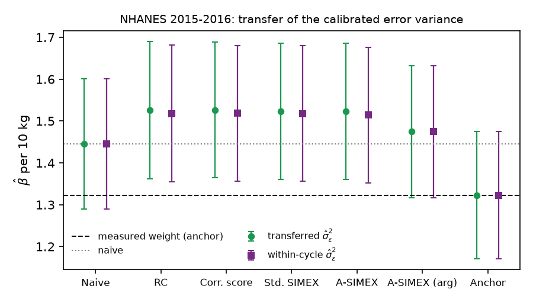

# Adaptive SIMEX for Poisson Regression

[](LICENSE)
[](https://www.python.org/)
[](adaptsimex/)
[](#reproducibility)

Replication archive for

> G. Garg and R. Mishra. **Adaptive SIMEX for Poisson Regression with
> Classical Measurement Error: Theory, Methods, and Applications.**

Adaptive SIMEX (**A-SIMEX**) corrects classical covariate measurement error
in Poisson regression by simulation–extrapolation with **cross-validated
hyperparameters** (extrapolation region `lambda_max` and polynomial degree,
selected under a one-standard-error parsimony rule), a **two-stage ridge
extrapolation**, and an **analytic sandwich variance** that decomposes into a
data component and an `O(1/B)` simulation component. The archive also ships
the Nakamura (1990) corrected-score estimator and regression calibration as
competitors.

This repository reproduces every table and figure in Sections 5–6 (simulation
studies and the NHANES application) and bundles a CRAN-style R package.

---

## Repository map

| Path | What it holds |
|------|---------------|
| **`code/`** | Python method library, Monte Carlo driver, figure/table builders, NHANES analyses |
| **`adaptsimex/`** | Self-contained R package (`adaptsimex` 0.1.0, GPL-3, base R only) |
| **`data/`** | NHANES `.XPT` files (CDC, public domain) — 2017–18 (`*_J`) and 2015–16 (`*_H`) cycles |
| **`results/`** | Generated tables (`.tex`), figures (`.pdf`/`.png`), raw Monte Carlo chunks, `.json` estimates |
| **`manuscript/`** | Revised manuscript source (`elsarticle`, Journal of Econometrics format) and compiled PDFs |

### `code/`

| File | Purpose |
|------|---------|
| `asimex_lib.py` | Method library: batched Poisson IRLS (vectorised across SIMEX replicates), standard SIMEX, Adaptive SIMEX (CV + 1-SE rule + argmin variant), ridge second stage (Sec. 3.2), Nakamura corrected score, regression calibration, analytic sandwich variance |
| `run_sims.py` | Monte Carlo driver — all scenarios, multiprocessing; writes `results/raw/*.npz` |
| `make_tables_figures.py` | Aggregates raw chunks → `table1`–`table5`, `fig1_bias`, `fig2_coverage`, `fig3_time` |
| `make_extra_figures.py` | Companion figures → `fig5_simex_curve`, `fig6_rmse`, `fig7_nhanes_forest` |
| `nhanes_analysis.py` | NHANES 2017–18 application → `nhanes_table.tex`, `fig4_sensitivity.*`, `nhanes_results.json` |
| `nhanes_transfer.py` | NHANES 2015–16 out-of-sample transfer of the calibrated error variance → `transfer_table.tex`, `fig8_transfer.*` |
| `validate_sandwich.py` | Analytic-vs-bootstrap sandwich validation (Sec. 5.7) |

### `results/`

* `raw/*.npz` — one file per scenario / design cell / block of 100 reps.
* `table1.tex … table5.tex` — manuscript tables (`booktabs`); `table1_small.tex` is the `n = 100, 300` appendix table.
* Figures (`.pdf` + `.png`):

  | File | Shows |
  |------|-------|
  | `fig1_bias` | Bias vs. `sigma^2`, by `n` |
  | `fig2_coverage` | CI-coverage heatmap under Laplace misspecification |
  | `fig3_time` | Computation time vs. `p` |
  | `fig4_sensitivity` | NHANES `sigma^2` sensitivity |
  | `fig5_simex_curve` | SIMEX-curve diagnostic on one simulated dataset |
  | `fig6_rmse` | RMSE vs. `sigma^2` panels |
  | `fig7_nhanes_forest` | NHANES coefficient forest plot |
  | `fig8_transfer` | 2015–16 transfer-application estimates |

* `nhanes_results.json`, `transfer_results.json` — point estimates and SEs consumed by the figure scripts.
* `section5_simulations.tex`, `section6_application.tex`, `revisions_manuscript_text.tex` — manuscript prose regenerated from the real numbers, plus a change log mapping every superseded draft claim to its evidence.
* `verification_master.tex`/`.pdf` — compiles Sections 5–6 with all tables and figures for a single-document check.

### `adaptsimex/` (R package)

`adaptive_simex()`, `cv_select()`, `simex_curve()`, `simex_sandwich()`,
`nakamura_corrected_score()`, `regression_calibration()`, with 6 `man/` pages,
a Sweave vignette (`vignettes/adaptsimex.Rnw`), and a `testthat` suite.
`R CMD check` on `adaptsimex_0.1.0.tar.gz`: 0 errors / 0 warnings / 1 NOTE
(local tooling only).

---

## Reproducibility

**Master seed: `20260905`.** Every Monte Carlo repetition and the NHANES
analyses draw randomness from
`numpy.random.SeedSequence(20260905, spawn_key=...)`, so all tables and
figures are bit-reproducible on any machine with `numpy >= 1.25`.

### Requirements

* Python **3.9+** with `numpy >= 1.25`, `pandas`, `matplotlib` (see
  [`requirements.txt`](requirements.txt))
* A LaTeX toolchain (`pdflatex`) to rebuild the manuscript / verification PDFs
* R **4.x** with `testthat` only if you want to rebuild or check the package

```bash
pip install -r requirements.txt
```

### Run the full pipeline

```bash
cd code
python3 run_sims.py all --chunk 100 --workers 16   # ~22 min on an M-series Mac
python3 make_tables_figures.py                      # tables 1-5, figs 1-3
python3 make_extra_figures.py                       # figs 5-7
python3 validate_sandwich.py                        # Sec. 5.7 validation
python3 nhanes_analysis.py                          # Sec. 6 application
python3 nhanes_transfer.py                          # 2015-16 transfer
```

Scenario IDs for `run_sims.py`:

| ID | Scenario |
|----|----------|
| `S1` | Main design, 4 × 3 cells (`n ∈ {100,300,500,1000}` × `sigma^2 ∈ {0.1,0.5,1.0}`) |
| `S2` | Laplace measurement-error misspecification |
| `S3` | Timing, `p ∈ {5,15,30,50}` |
| `T4` | Negative-binomial overdispersion with robust SEs |
| `T5` | Estimated `sigma^2` from `m = 2` replicates |

### NHANES applications

`nhanes_analysis.py` (2017–18) and `nhanes_transfer.py` (2015–16) read the
`.XPT` files in `data/` with `pandas.read_sas`. The `RXQ_RX` prescription
files hold one row per medication record, so both scripts deduplicate to
person level (`drop_duplicates("SEQN")`) and set `RXDCOUNT = 0` for persons
with no medication record before the complete-case filters (final samples
`n = 5,628` and `n = 6,100`).

---

## Method configuration

| Parameter | Value |
|---|---|
| SIMEX replicates `B` | 100 |
| CV folds | 5 |
| CV replicates per fold-curve `B_cv` | 25 |
| `lambda_max` grid | {0.5, 1.0, 1.5, 2.0, 2.5} |
| Degree grid | {1, 2, 3} |
| Standard SIMEX grid | {0, 0.5, 1, 1.5, 2}, quadratic |
| Ridge second stage | `gamma = 0.01`, degree + 2 |
| Standard errors | analytic sandwich (Theorem 2 / Corollary 1 of the proofs) |

---

## Key empirical findings

1. **Small error (`sigma^2 = 0.1`)** — A-SIMEX matches the best competitor
   (bias `-0.011` vs. naive `-0.066` at `n = 1000`) with valid coverage
   (0.84–0.91).
2. **Large error (`sigma^2 = 1.0`)** — residual polynomial-extrapolation bias
   dominates *every* SIMEX variant (std `-0.149`, A-SIMEX 1-SE `-0.191`). The
   observed-scale CV criterion systematically under-extrapolates: its
   population minimizer is the naive pseudo-parameter `beta(1)`, not `beta_0`
   (Lemma 1). This supersedes the draft's near-oracle-at-all-error claim.
3. **Efficiency premium of extrapolation** is large and quantifiable
   (RMSE ratio to oracle ≈ 2.6 at `sigma^2 = 0.1`, `n = 1000`), matching the
   weight-norm sum `sum |c_j| ≈ 7.8` of the quadratic extrapolant (Theorem 3).
4. **Analytic sandwich** recovers 66–91% of the bootstrap variance
   (first-order understatement, improving in `n`); the software exposes a
   bootstrap option for small samples.
5. **Robustness** — corrections hold under (a) Gaussian-assumption
   misspecification (Laplace DGP), (b) negative-binomial overdispersion with
   robust SEs, and (c) replacing known `sigma^2` by a replicate-based estimate.
6. **NHANES** — all corrections agree (`+0.50`–`0.51` per 10 kg, s.e. `0.026`
   vs. naive `+0.490`); the measured-weight anchor (`+0.468`) sits 1.5 SE
   below, consistent with nonclassical (truth-correlated) self-report error,
   and estimates are stable across a fourfold `sigma^2` sensitivity range.

---

## Figures

All regenerated by the pipeline above; PDF versions live alongside the PNGs in
[`results/`](results/).

### Simulation studies (Section 5)

<table>
<tr>
<td width="50%"><br><sub><b>Bias vs. <code>sigma^2</code>, by <code>n</code></b> — A-SIMEX matches the best competitor at small error; all SIMEX variants retain extrapolation bias at large error.</sub></td>
<td width="50%"><br><sub><b>RMSE vs. <code>sigma^2</code></b> — the efficiency premium of extrapolation relative to the oracle.</sub></td>
</tr>
<tr>
<td width="50%"><br><sub><b>CI-coverage heatmap</b> — analytic-sandwich coverage under a Laplace measurement-error DGP.</sub></td>
<td width="50%"><br><sub><b>SIMEX-curve diagnostic</b> — extrapolant fit on one simulated dataset.</sub></td>
</tr>
<tr>
<td width="50%"><br><sub><b>Computation time vs. <code>p</code></b> — cost scaling of the batched IRLS / CV routine.</sub></td>
<td width="50%"></td>
</tr>
</table>

### NHANES application (Section 6)

<table>
<tr>
<td width="50%"><br><sub><b>Coefficient forest plot</b> — naive, A-SIMEX, Nakamura, regression calibration, and the measured-weight anchor (2017–18).</sub></td>
<td width="50%"><br><sub><b><code>sigma^2</code> sensitivity</b> — estimates across a fourfold assumed-error-variance range.</sub></td>
</tr>
<tr>
<td width="50%"><br><sub><b>Transfer application</b> — 2015–16 cycle with the error variance calibrated out-of-sample.</sub></td>
<td width="50%"></td>
</tr>
</table>

---

## Citing

See [`CITATION.cff`](CITATION.cff), or use GitHub's **“Cite this repository”**
button.

## License

[GPL-3.0](LICENSE). NHANES `.XPT` files are U.S. CDC public-domain data.
